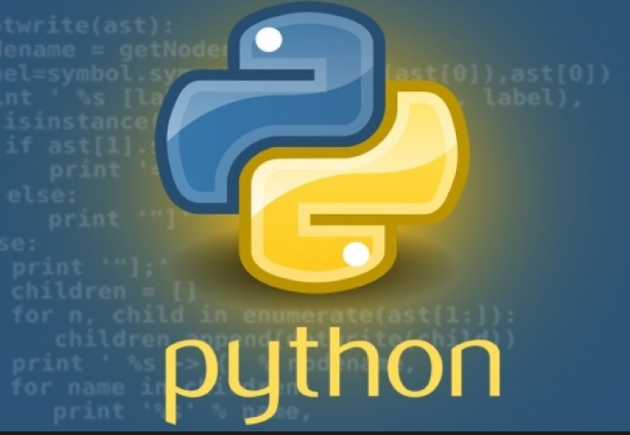
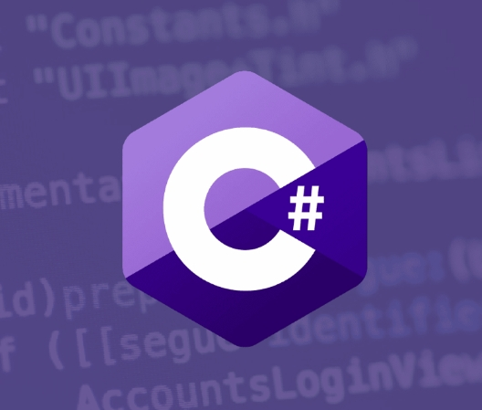
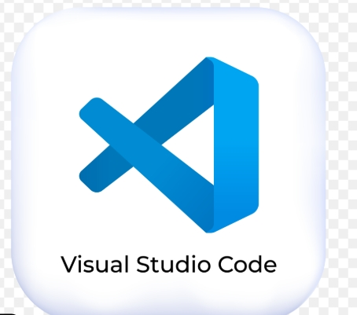
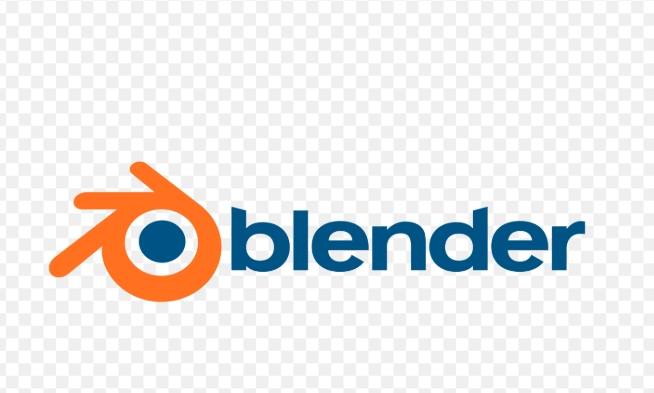
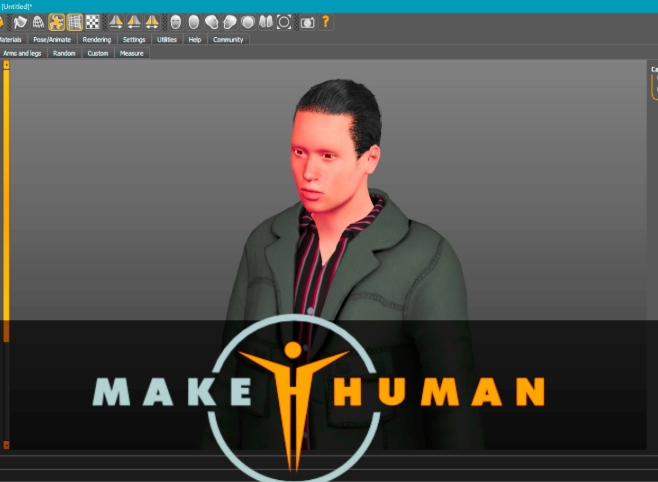
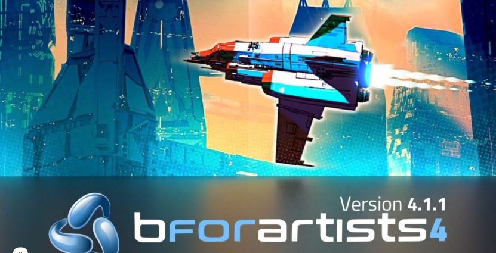
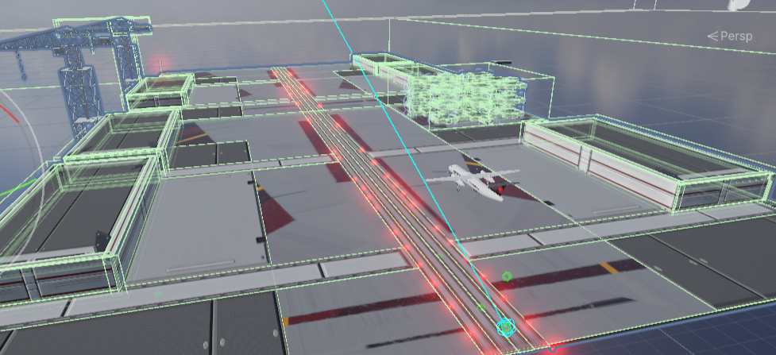
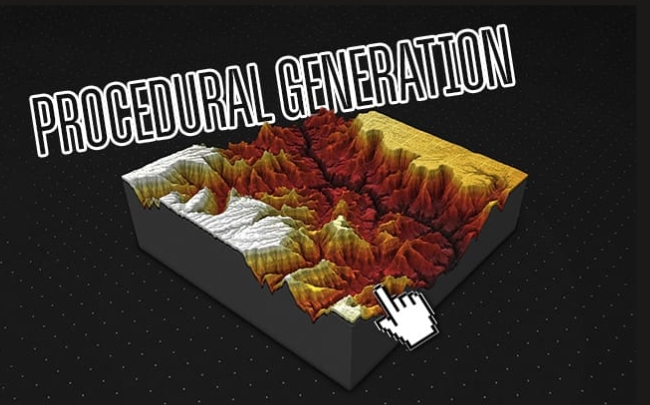
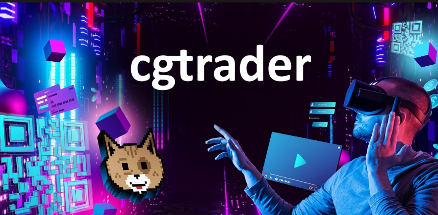

# Uday Pratap Chaudhary

### Independent Software Builder • AI • 3D • Unity • Automation • Research

I build software, AI systems, automation tools, interactive 3D applications, simulations, and creative digital products.

I enjoy turning ideas into working systems — combining programming, AI, 3D, and real-time technologies to build things that can actually be used.

## What I Work With

### Software & AI

- Python

- AI & Automation

- Flutter & Dart

- C#

- Git & GitHub

- Visual Studio Code

### 3D & Real-Time Development

- Unity

- Blender

- MakeHuman

- Bforartists

- 3D Modeling & Visualization

- Animation

- Procedural Generation

- Real-Time Simulation
## Projects & Work

I have built and released software, games, automation tools, AI projects, and 3D assets.

Some of my work has been published through:

- Google Play Store- 
-https://play.google.com/store/apps/developer?id=Uday+Pratap+Chaudhary

-itch.io- 
-https://uday-pratap-chaudhary.itch.io/

- CGTrader
-https://www.cgtrader.com/designers/upc-studio

My public GitHub repositories showcase selected projects, experiments, and technical work.

## Current Focus

- AI-powered software
- Interactive scientific simulations
- 3D systems and procedural generation
 1.https://www.cgtrader.com/designers/upc-studio
 2.https://uday-pratap-chaudhary.itch.io/
- Automation and intelligent workflows
- Game and application development
 1.https://play.google.com/store/apps/developer?id=Uday+Pratap+Chaudhary
- Research and experimentation
- 3D storytelling and cinematic episodes

## Future Direction

I am working toward building larger systems that combine:

**AI + Software + 3D + Simulation + Storytelling**

I also plan to create original 3D story episodes using my own characters, environments, animation, technology, and creative systems.

## Connect

- GitHub: [@udaypratap-ai](https://github.com/udaypratap-ai)
